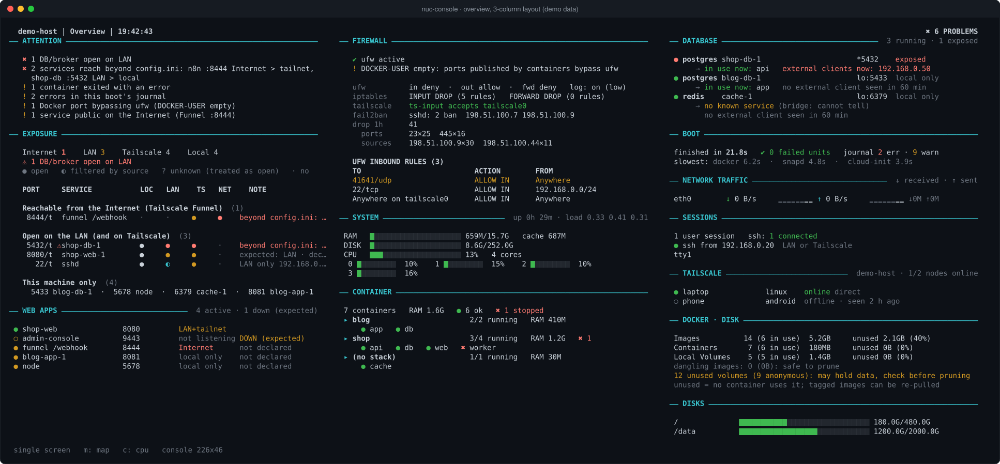
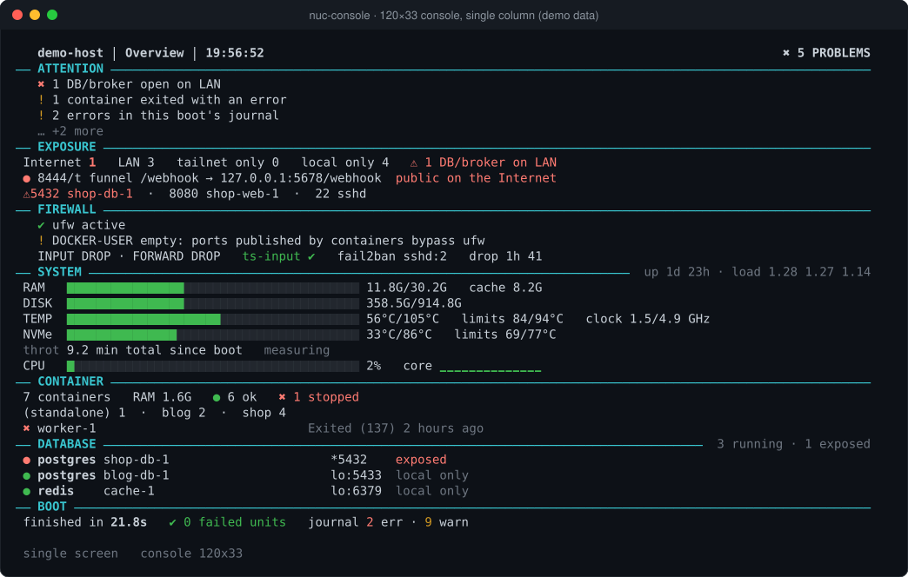
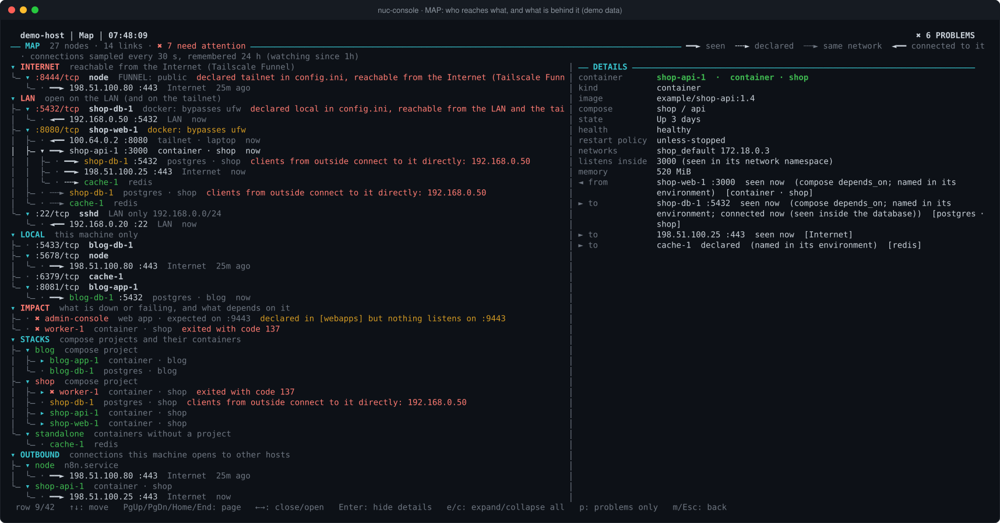
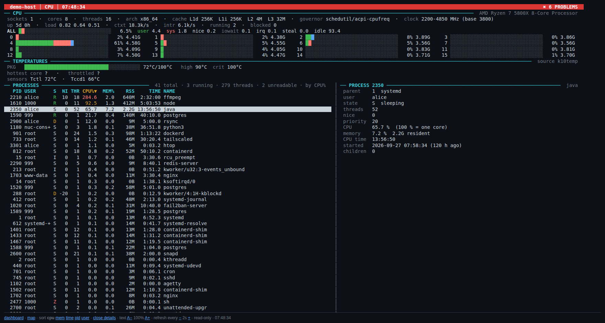
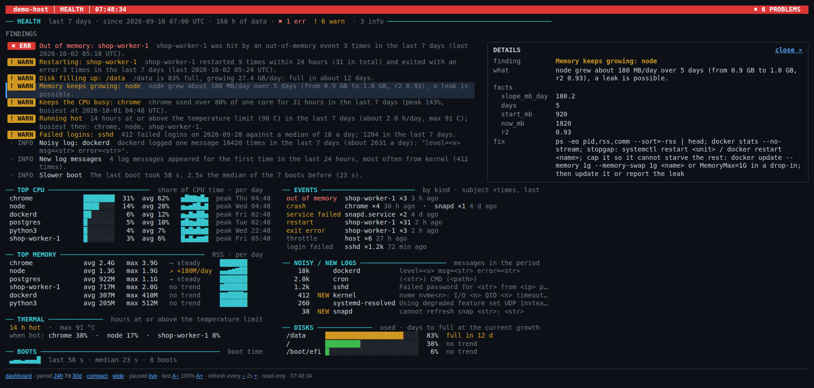
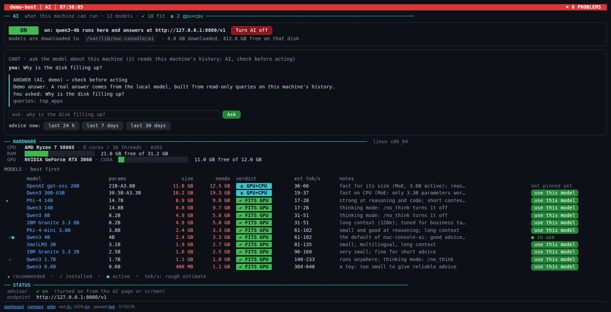
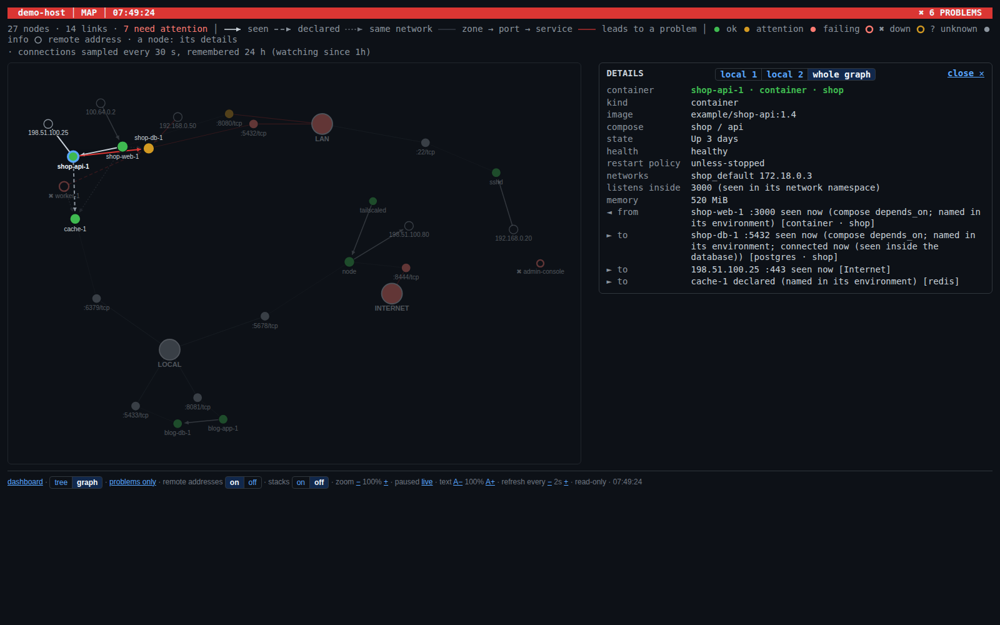

<div align="center">

# 🖥️ nuc-console

**Turn the forgotten monitor of your headless Linux box — or Mac, or Windows PC — into a live security & health board.**<br>
Linux: no X11, no browser · macOS/Windows: one full-screen local page · no dependencies · one screen · ~0.5 % of a CPU core

[](LICENSE)
[](https://github.com/give-jd/nuc-console-oss/releases)
[](#requirements)
[](#requirements)
[](docs/INSTALL.md#macos)
[](docs/INSTALL.md#windows)
[](#security)

[**Download**](#download) · [**Quick start**](#quick-start) · [**Install guide**](docs/INSTALL.md) · [**Configuration**](#configuration) · [**How it works**](#how-it-works) · [**Security**](SECURITY.md)

<a href="docs/img/overview.svg"></a>

<sub>The real screen on a 226-column console (3-column layout), rendered from <code>--demo</code> synthetic data. Click to zoom.</sub>

</div>

## ✨ At a glance

| | |
|---|---|
| 🌐 **Exposure by reach** | every listener classified as *local / LAN / Tailscale / Internet (Funnel)*, corrected by the real firewall |
| 🧱 **Firewall truth** | ufw, iptables, `DOCKER-USER`, fail2ban — flags *Docker ports that bypass ufw* and *Tailscale accepted before ufw* |
| 🧾 **Problem inventory** | every ATTENTION item has a stable id, an explanation and a fix: `nuc-console-problems` lists them, `sudo nuc-console-accept --problem <id> --reason "…"` marks a known one (dimmed, not counted) |
| 🕸️ **Web apps** | WEB APPS section: the apps you declared (active, or DOWN when expected but not listening) and the web listeners found on their own, with how far each is reachable |
| 🚨 **Port alarms** | a baseline of exposed ports; any new, changed or vanished port turns the banner red |
| 🎯 **Expected vs actual** | declare under `[expose]` how far each service may reach (`local`, `tailnet`, `lan`, `internet`): ATTENTION raises an error when it reaches further, and the matrix, overview and map mark it |
| 🗺️ **Map** | who reaches what, and *what is behind it*: zone → open port → process or container → what that one uses (`LAN → :8080 → shop-web → shop-api → shop-db`), what breaks if something is down, compose stacks, outbound connections. Every link says how it is known (*seen* / *declared* / *same network*); navigable: open, close, expand all, details of any node, problems only (console `m`/`Tab`, web **map** link). In the browser also as a **graph** of circles and lines, like Obsidian: drag, zoom, the local graph of one node |
| 🐳 **Containers & databases** | per-stack health, real published ports, *who actually connects* to each DB (seen inside its network namespace) |
| 🧮 **CPU, like htop** | a screen of its own (console `c`, web **cpu** link): model, cores and P/E cores, caches, per-core load (user / system / iowait) with frequency and temperature, load average, context switches, throttling, and the processes sortable by CPU, memory, time, PID or user, with a details pane. Names only, never command lines (they can hold passwords) |
| 🌡️ **Health now** | boot time and slowest units, failed units, journal errors, CPU/NVMe temperature, thermal throttling, disks, traffic |
| 🩺 **HEALTH over time** | a small local history (SQLite) and a screen of its own (console `h`, web **health** link): over the last day, week or month, which apps use the CPU and memory, which crash, hang or get killed, which services and containers keep restarting, hot hours, disks filling up ("full in 12 days"), noisy or new log messages, each with how to fix it. Rules over numbers; names and counts only, never command lines or log lines as they are ([docs/HEALTH.md](docs/HEALTH.md)) |
| 🤖 **AI advisor** *(optional, off by default)* | an **AI** page (web **ai** link) and screen (console `a`) read this machine's RAM, GPU and GPU memory and tell, model by model, whether it *fits entirely on the GPU*, runs on *GPU+CPU* or *in RAM*, *fits but slows the PC*, or is *too big*, with a rough speed; **choose a model and it does the rest**: downloads the open model (hash-pinned; 12 sizes, 0.4 to 19 GB) with a progress bar into a folder it names, starts it on 127.0.0.1 and turns the AI on (**AI on/off** is one button or key); a chat on the web page; `nuc-console-ai` / `nuc-console-ask` do the same from a terminal. It turns the HEALTH findings into plain advice and answers questions from the history. It analyses, **never acts**; Linux, macOS, Windows ([docs/AI.md](docs/AI.md)) |
| 🔒 **Least privilege** | small root collector + unprivileged renderer, stdlib only, nothing reachable from the network (macOS/Windows: the page is on 127.0.0.1 only) |
| 📦 **Download, run, update** | one archive per system on the [releases page](https://github.com/give-jd/nuc-console-oss/releases/latest), built and attested by CI, with `SHA256SUMS`; the Windows ZIP carries its Python, so it installs offline. `./run.sh` / `run.cmd` run it without installing (everything stays in `./data`); `nuc-console-update` updates only when *you* run it, hash and build provenance checked ([Download](#download)) |
| 🖥️ **Linux, macOS, Windows** | one command each; on macOS and Windows the same screen in your browser or full screen at login (your choice, text size A− / A+), and the exposure is judged by the **Application Firewall** / **Windows Firewall** per program ([install guide](docs/INSTALL.md)) |
| 🎛️ **Configurable** | switch every section on/off, **fixed and reorderable section order**, single screen or rotating pages, pin the layout size, refresh every 1–10 s |
| 🌍 **Web view** | optional: the same screen in a browser over Tailscale/LAN, read-only except the AI page's buttons ([docs/WEB.md](docs/WEB.md)); off by default, token or loopback only; `[ai] web_actions = no` makes it read-only for good |
| 📨 **Telegram alerts** | optional: new and resolved problems on your phone, through a Telegram bot of your own (free, three steps: [docs/TELEGRAM.md](docs/TELEGRAM.md)). Titles only by default; it only sends (HTTPS to Telegram: no listener, no webhook, it never reads messages, no commands); off by default |
| 🔍 **Nothing hidden** | what the overview cuts ("… +N more") is shown in full on rotating **Details** pages (no keyboard needed) and in the web view (`/?full=1`) |
| 🧪 **Try it without root** | `python3 src/render.py --once --demo` |

<details>
<summary><b>Smaller consoles: the layout adapts</b> (120×33, single column)</summary>
<br>

</details>

<details>
<summary><b>The MAP: who reaches what, and what is behind it</b> (200×46, details of a container open)</summary>
<br>

</details>

<details>
<summary><b>The CPU screen, like htop</b> (per-core load, frequency and temperature; processes; details of one)</summary>
<br>

</details>

<details>
<summary><b>HEALTH over time</b> (what keeps going wrong in the last day, week or month, with a fix for each)</summary>
<br>

</details>

<details>
<summary><b>The AI page</b> (choose a model and it is downloaded, started and turned on; AI on/off; chat; which models this machine can run)</summary>
<br>

<br>
Caption: the AI page of the web view, from `python3 src/web.py --demo` (nothing is downloaded or started in the demo). The console AI screen (key `a`) has the same switch (`e`), the same **use this model** (`u`) and the same folder line; the chat is on the web page.
</details>

<details>
<summary><b>The MAP as a graph</b> (browser: circles and lines, drag and zoom)</summary>
<br>

</details>

## Why

A home server or NUC with a monitor attached usually shows a login prompt nobody reads. This turns it into a
"glanceable" security and health board, built around one question that `htop` and Grafana don't answer:

> *Which of my services can actually be reached from where — and did that change since I last looked?*

- **Exposure by reach, not by bind address.** Every listener is classified as local / LAN / Tailscale / Internet (Funnel),
  then corrected by the real firewall: `ufw` rules, `DOCKER-USER`, and the two famous surprises — **Docker-published ports bypass ufw** and
  **`tailscale0` is accepted before ufw** — are detected and flagged.
- **Port alarms.** A baseline of the exposed ports is stored on install; a new, changed or vanished port raises a red banner until you accept it (`sudo nuc-console-accept`).
- **Honest about missing data.** Unreadable or missing sections show `?` and are treated as open, never as "OK". A tool that isn't installed is reported as such, not as an error.
- **Databases.** Finds postgres/redis/mysql/mongo/… containers, shows their *real* published ports and which containers/hosts actually connect (seen inside the container's network namespace, so Docker's DNAT can't hide external clients).
- **Map.** The sections above say *which* ports are open; the MAP follows each one to what is behind it — `LAN → :8080 → shop-web → shop-api → shop-db`
  reads "the LAN reaches the database through web and api", `LAN → :5432 → shop-db` reads "the database is open on the LAN". The IMPACT branch
  answers the other question: this is down, what depends on it? Links are *seen* (a live connection, inside each container's network namespace),
  *declared* (compose `depends_on`, a container named in another's environment, service dependencies) or *same network*, and drawn differently.
- **Least privilege.** A small root *collector* runs the privileged commands and writes JSON to `/run`; the *renderer* that owns the tty runs as an unprivileged user and only reads `/proc`, `/sys` and that JSON. No network listener unless you opt in to the web view (read-only; only the AI page has buttons; macOS/Windows show the dashboard through it, on 127.0.0.1 only).
- **Adaptive layout.** One screen from 79×24 up to 4K consoles: 1 column → 2 (≥200 cols) → 3 (≥225 cols), dropping detail before dropping sections.

## Requirements

| | |
|---|---|
| OS | **Linux** with systemd (Debian/Ubuntu/Fedora/Arch… anything with `systemd`, `/proc`, `/sys`) · **macOS** 11 or newer · **Windows** 10/11 or Server 2019+ (64-bit x86 or ARM) |
| Python | 3.8 or newer, standard library only, and **none needed on the machine for a release archive: every archive carries its own** (Linux and macOS: a python-build-standalone CPython, Windows: the official embeddable Python). From a clone: Linux the system's `python3`; macOS a python.org or Command Line Tools Python, installed from python.org (hash-checked) if missing; Windows a private copy of the embeddable Python, downloaded once, hash-checked, and kept for the next update |
| Root | only for the installers, the updater of an installed one and the collector service (Windows: Administrator, the collector runs as SYSTEM). The [portable run](docs/PORTABLE.md) needs none (what needs it then shows less) |
| Optional tools | Linux: `docker`, `ss` (iproute2), `ufw`, `iptables`, `fail2ban-client`, `tailscale`, `systemd-analyze`, `journalctl`, `nsenter`, `nvidia-smi` (the AI screen's NVIDIA memory). macOS/Windows: Docker Desktop (or OrbStack), Tailscale. Each one that is missing simply disables its section — nothing crashes |
| Display | Linux: a virtual terminal. macOS/Windows: it opens at every login, your choice how — a normal browser window (default) or full screen (Alt+F4 / Cmd+Q closes it); text size with **A− / A+** |

## Download

Every [release](https://github.com/give-jd/nuc-console-oss/releases/latest) has one archive per system **and processor** and a `SHA256SUMS` file, built and attested by CI
(`X.Y.Z` is the release number). **Every archive has everything it needs, its own Python included: download, unpack, use, with no Python on the machine and no
network.**

| System | Archive | Run it without installing | Install |
|---|---|---|---|
| Linux, Intel/AMD 64-bit | `nuc-console-X.Y.Z-linux-x86_64.tar.gz` | `tar xzf nuc-console-X.Y.Z-linux-x86_64.tar.gz && cd nuc-console-X.Y.Z && ./run.sh` (in the terminal) | `sudo ./install.sh` |
| Linux, ARM 64-bit (Raspberry Pi 4/5 64-bit...) | `nuc-console-X.Y.Z-linux-arm64.tar.gz` | the same | `sudo ./install.sh` |
| macOS, Apple Silicon | `nuc-console-X.Y.Z-macos-arm64.tar.gz` | `tar xzf nuc-console-X.Y.Z-macos-arm64.tar.gz && cd nuc-console-X.Y.Z && ./run.sh` (in the browser) | `sudo ./install.sh` |
| macOS, Intel | `nuc-console-X.Y.Z-macos-x86_64.tar.gz` | the same | `sudo ./install.sh` |
| Windows, Intel/AMD | `nuc-console-X.Y.Z-windows-x64.zip` | extract it, double-click `run.cmd` (in the browser) | double-click `install-windows.cmd` |
| Windows on ARM | `nuc-console-X.Y.Z-windows-arm64.zip` | the same | the same |

`uname -m` says which processor a Linux or macOS machine has (`x86_64`, or `aarch64` / `arm64`); 32-bit systems have no archive.

- **Check it**: `sha256sum --ignore-missing -c SHA256SUMS` (macOS: `shasum -a 256`; Windows: `Get-FileHash`) and
  `gh attestation verify <archive> --repo give-jd/nuc-console-oss`: [how, and what they prove](docs/INSTALL.md#check-it).
- **Offline**: every archive carries its Python (Linux and macOS: python-build-standalone, unpacked in `python/`; Windows: the official embeddable Python), so
  running or installing it needs no download and no Python on the machine. [Where it comes from, and how it is pinned and verified](SECURITY.md#the-python-in-the-archives).
  Nothing is ever downloaded twice: what an installer of a clone fetches is kept and reused.
- **Portable**: `./run.sh` / `run.cmd` install nothing, create no service and write only to `./data`; Ctrl+C stops everything.
  Without root it still runs, and shows less. [docs/PORTABLE.md](docs/PORTABLE.md).
- **Update**: `nuc-console-update --check` says whether a newer release exists, `nuc-console-update` (`sudo` for an installed one) updates it.
  It runs only when *you* start it; it checks the SHA-256 and, with `gh` installed, the build provenance, and keeps your config and baseline.
  [docs/INSTALL.md#update](docs/INSTALL.md#update).

## Quick start

```bash
git clone <this repository> nuc-console && cd nuc-console
python3 src/render.py --once --demo --cols 200 --rows 50    # try it: synthetic data, no root, no install
python3 -m unittest discover -s tests                        # optional: run the test-suite
sudo ./install.sh                                            # Linux: install + switch tty1 to the dashboard now
sudo ./install.sh                                            # macOS: the same command (launchd, full-screen browser at login)
```

From a release archive instead of git: extract it and run the same commands (Windows: double-click **`install-windows.cmd`**, it asks for administrator
rights). Preview a macOS or Windows screen anywhere with `--demo-os darwin` / `--demo-os windows`.

Full guide (VT choice, time zone, font, update, uninstall, troubleshooting): **[docs/INSTALL.md](docs/INSTALL.md)**.

## Configuration

`/etc/nuc-console/config.ini` (created on first install, never overwritten; Windows: `%ProgramData%\nuc-console\config.ini`; a portable run: `data/config.ini`). Everything defaults to *on*:

```ini
[features]
containers = yes      databases = yes     exposure = yes      firewall = yes
fail2ban   = yes      tailscale = yes     boot     = yes      docker_disk = yes
network_traffic = yes sessions  = yes     disks    = yes      thermal  = yes
cpu      = yes      health   = yes
ai       = yes      # the AI screen and page (key a): choose a local model, AI on/off ([ai] web_actions = no: read-only)
webapps  = yes      map      = yes

[dashboard]
mode = overview       # overview (one screen, no keyboard) | rotate (3 pages, keys 1-3)
rotate_seconds = 15
refresh_seconds = 2   # redraw every 1-10 s: console, full-screen window and browser pages (- / + on the page)
# sections = attention, exposure, webapps, firewall, system, containers, databases, boot, network_traffic, sessions, tailscale, docker_disk, disks
#            ^ fixed on-screen order (this is the default, by priority); columns fill left to right, never back-filled
columns = 0           # 0 = real console size; set e.g. 235 if elements run off the screen
rows = 0              # e.g. 65 if the bottom lines are cut by the monitor
spacing = 1           # a blank line under each section title (0 = compact)
details = yes         # pages with everything the overview cuts ("… +N more"), rotating on the monitor
overview_seconds = 45
map_in_rotation = no  # yes: the MAP joins the rotating pages too (a monitor with no keyboard)
cpu_in_rotation = no  # yes: the CPU screen joins them too
health_in_rotation = no  # and the HEALTH screen

[webapps]             # apps you EXPECT to be reachable: shown as active or DOWN; not a Docker-bypass problem
ethibid = 8180, 8543

[ai]                  # optional local model for the HEALTH advice, see docs/AI.md; off by default
enabled = no
endpoint = http://127.0.0.1:11434/v1   # any OpenAI-compatible server on this machine: Ollama, LM Studio, llama.cpp, llamafile
model =
gpu = auto            # auto | no: with no, `nuc-console-ai serve` never puts the model on the GPU (an installed service: `serve --install-service` again)
web_actions = yes     # yes | no: the AI page and screen may set a model up, switch the AI on/off, ask; no: they only show (the lock)

[web]                 # optional web view (read-only; the AI page has buttons), see docs/WEB.md
enabled = no

[telegram]            # optional alerts on your phone, see docs/TELEGRAM.md
enabled = no          # set up with: sudo nuc-console-telegram --setup
```

A disabled section is not drawn, raises no alarm, and — for the collector-side ones — **its commands are never run as root**.
Apply with `sudo systemctl restart nuc-console nuc-console-collector nuc-console-web`. After an upgrade, `diff /etc/nuc-console/config.ini{,.dist}` shows the options added since you copied the file.
**Full reference of every key, default and command: [docs/CONFIGURATION.md](docs/CONFIGURATION.md)** (commented example: [config/config.ini](config/config.ini)).

## ATTENTION: inventory, analysis, accepting

The ATTENTION list is generated from the current state, and every item has a stable id:

```bash
nuc-console-problems            # all current items with why it matters and how to fix it (add --json for scripts)
sudo nuc-console-accept --problem docker-bypass --reason "ethibid web app, exposed on purpose"
sudo nuc-console-accept --forget docker-bypass
```

Accepted items are dimmed ("N accepted" under ATTENTION) and no longer count in the header. The list lives in `/var/lib/nuc-console/accepted.json`; a missing or broken file accepts nothing.
For web apps you expose on purpose, declare them under `[webapps]` instead: they appear in WEB APPS and stop counting as "Docker port bypassing ufw".
To say how far a service may reach, declare it under `[expose]` (`shop-db = local`): ATTENTION raises "over-exposed" when it reaches further than that, and never hides the other alarms.

## AI advisor (optional)

Which local language model can this machine run? The **AI** screen (console key `a`, web **ai** link,
`python3 src/render.py --once --demo --view ai` to try it) reads the RAM, the GPU and its memory, and rates each model of a
short list: *fits entirely on the GPU*, *GPU+CPU*, *fits in RAM*, *fits but will slow the PC*, *too big, will not work*, with a rough
speed. And it is where you **set one up**: choose a model (the **use this model** button, console `u`) and it is downloaded (hash-pinned, with a progress bar, into the folder the page
names), started on 127.0.0.1, and the AI is turned on; **AI on / off** is one button (console `e`); the web page has a chat. The same from a terminal:

```bash
nuc-console-ai models                         # the same table in a terminal; no root (/usr/local/sbin/nuc-console-ai if your PATH lacks sbin)
sudo nuc-console-ai setup                     # downloads the recommended runtime and model once, SHA-256 checked (Windows: an administrator prompt, no sudo)
sudo nuc-console-ai serve --install-service   # serves it on 127.0.0.1 only, on the GPU when the model fits there; then set [ai] enabled = yes
nuc-console-ask advise                        # advice on the HEALTH findings; nuc-console-ask "why is the disk filling up?"
```

Already running Ollama, LM Studio or a llama.cpp server? Set `[ai] endpoint` and `model` instead. The model **suggests and never acts**: no
command is run, the history is read through six fixed read-only queries, names from the machine reach it only as data, the endpoint must be
on this machine, and every answer is marked "AI, check before acting". It is one more thing to download and keep (a model is 0.4 to 19 GB):
nothing is fetched until you choose a model or run `setup`, which download only what this release pins (the runtime and the models). The buttons are the one part of the web view
that is not read-only: whoever can open the page can press them, and `[ai] web_actions = no` locks them. Choosing, the buttons and keys, the folder per system, GPU support, the commands,
files and the security rules: **[docs/AI.md](docs/AI.md)**.

## How it works

```
  root, systemd ─ collector.py ─ docker · ss · ufw · iptables · fail2ban · tailscale · systemd-analyze · journalctl · nsenter
                        │ JSON (0644, atomic rename)            /run/nuc-console/{containers,net,boot}.json
                        ▼
  unprivileged  ─ render.py ──── /proc · /sys · the JSON ──────► ANSI on /dev/tty1 (redraw in place, no flicker)
```

- `nuc-console.service` owns the VT (`TTYPath=/dev/tty1`), `Restart=always`. `install.sh` masks `getty@tty1` so nothing draws over it; login stays on **tty2** (Ctrl+Alt+F2) and SSH.
- **macOS / Windows**: the collector is a LaunchDaemon (root) / a scheduled task (SYSTEM) that reads sockets, the OS firewall and services
  with native tools (`lsof`, `socketfilterfw`, `launchctl` / the IP helper API and PowerShell) and judges every listening port against the
  firewall *per program*. The web view (unprivileged, read-only apart from the AI page's buttons) serves the same screen on **127.0.0.1 only**, and at every login it opens
  in a normal browser window (or full screen: `[display] mode = fullscreen`); a *nuc-console* shortcut reopens it. Same layout, same alarms.
- Exposure rules and the design principles behind the layout: [docs/DESIGN.md](docs/DESIGN.md). Hardening the things it reports: [docs/HARDENING.md](docs/HARDENING.md).

### Cost

Measured on a 14-thread x86 mini-PC: renderer (2 s refresh, the default; 240×67) **≈0.5 % of one core, ~14 MB RSS**; the root collector runs its commands every 10–30 s (< 0.5 s CPU in total). Per-container memory is read from cgroup files, not `docker stats` (2 s per call).

## Web view (optional)

Want the screen in a browser? `[web] enabled = yes`, then `tailscale serve --bg 8787`. Read-only (except the AI page's buttons, which `[ai] web_actions = no` locks), binds to loopback unless you give it a token; no JavaScript except the small, hash-pinned script that lets you drag and zoom the MAP's graph view.
Setup and threat model: **[docs/WEB.md](docs/WEB.md)**. Config editing from the web is deliberately not offered.

## Telegram alerts (optional)

Want the problems on your phone? Create a bot with @BotFather (free), run `sudo nuc-console-telegram --setup` (token and your `@username`), tap the link it prints and press Start: new and resolved ATTENTION problems then arrive as messages (titles only unless `detail = full`).
It only sends: no listener, no webhook, the service never reads messages and has no commands; the token stays in its own 0600 folder, never in `config.ini`. Off by default.
Set-up, what leaves the machine, troubleshooting: **[docs/TELEGRAM.md](docs/TELEGRAM.md)**.

## Security

It reads sensitive-looking facts (ports, container names) and runs privileged commands, so it is built defensively: fixed command lines (no shell, no user input), output sanitised against terminal-escape injection, secrets in container env are matched but **never stored or shown**, state files are world-readable on purpose (no secrets inside) and written atomically. The monitor itself shows your topology to anyone in the room — keep that in mind.
Read the threat model, how releases are built and verified, and how to report a vulnerability in **[SECURITY.md](SECURITY.md)**.

## Limitations

- Linux: the exposure logic knows `ufw`, `iptables`/`ts-input` and Docker; **nftables-native** or firewalld rulesets are not interpreted (shown as unknown `?`).
- macOS/Windows: the CPU temperature is best effort (macOS: `powermetrics` on Intel Macs; on Apple Silicon only with `smctemp` or `osx-cpu-temp` installed. Windows: LibreHardwareMonitor or OpenHardwareMonitor if running, else the ACPI thermal zones, often absent) and `?` when there is none; no throttling counters, fail2ban or "who connects" inside containers (Docker Desktop runs them in a VM); Windows Firewall rules from Group Policy, port keywords (RPC…) and macOS `pf` rules show as unknown `?`. Details: [docs/INSTALL.md](docs/INSTALL.md#macos).
- Non-systemd Linux (OpenRC, runit…) and the BSDs are not supported.
- Docker-published ports are assumed TCP; `tailscaled` ephemeral ports (≥32768 except 41641) are ignored; one NVMe sensor is read.
- The AI screen reads GPU memory with `nvidia-smi` (NVIDIA), `/sys/class/drm` (AMD and Intel Arc, Linux), `system_profiler` (Intel Macs) and the display adapters' registry entries (Windows); what it cannot read is listed in its notes, not guessed. Speeds are rough estimates. Integrated Intel GPUs and AMD APUs share the RAM and count as no GPU.
- HEALTH needs a day of history before it draws trends (memory growth, disk forecast); crashes and OOM kills show from the first one. On macOS it reads crash reports, not the unified log.
- Connections shorter than the 30 s sampling window are not seen by the database "who connects" view nor by the MAP (which remembers what it saw for 24 h).
- MAP on macOS/Windows: the containers' own connections are inside Docker Desktop's VM, so container-to-container links are *declared* or *same network* only.

## Contributing · License

See [CONTRIBUTING.md](CONTRIBUTING.md); what changed in each release: [CHANGELOG.md](CHANGELOG.md). Released under the [MIT License](LICENSE). Copyright © 2026 [Gi.Ve Group S.r.l.](https://givegroup.it)
